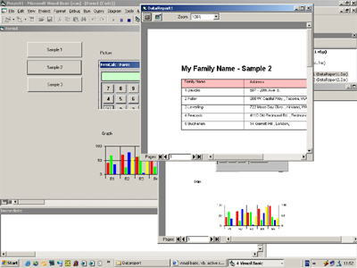



## Data Report Without DataEnvironment \( Update \)

### Description

update from my previus posting.

This my sample code how to manipulate Datareport without using DataEnvironment

this sample included datashape concept and how to link image dynamicly.
 
### More Info
 

             |
---                |---
**Submitted On**   |2003-08-29 10:26:54
**By**             |[Hanafiah](https://github.com/Planet-Source-Code/PSCIndex/blob/master/ByAuthor/hanafiah.md)
**Level**          |Intermediate
**User Rating**    |4.8 (133 globes from 28 users)
**Compatibility**  |VB 6\.0
**Category**       |[Databases/ Data Access/ DAO/ ADO](https://github.com/Planet-Source-Code/PSCIndex/blob/master/ByCategory/databases-data-access-dao-ado__1-6.md)
**World**          |[Visual Basic](https://github.com/Planet-Source-Code/PSCIndex/blob/master/ByWorld/visual-basic.md)
**Archive File**   |[Data\_Repor1636988282003\.zip](https://github.com/Planet-Source-Code/hanafiah-data-report-without-dataenvironment-update__1-47603/archive/master.zip)

